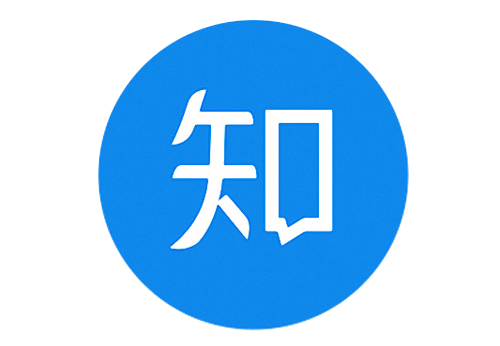
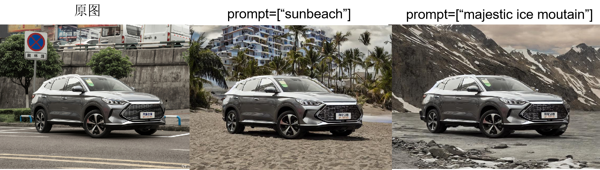
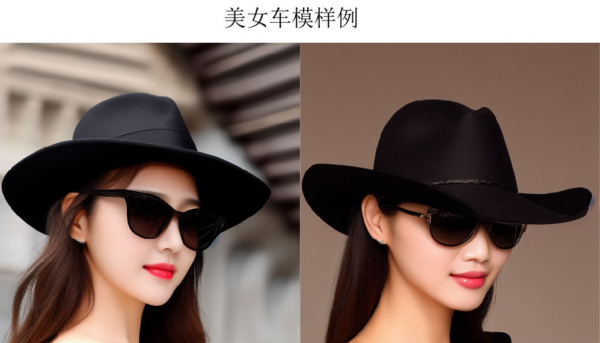

# 关于我

 
算法工程师，本硕毕业于大连理工大学(2012-2019) 
<ul>
  <li>  </li>
  <li>  </li>
</ul>  
 

# 工作经历
* 汽车之家 (2020/08 ~ )
    * 负责拍照识车算法优化(yolov3+EfficientNet)及服务端/移动端部署
    * 负责首页主feed视频推荐策略，以及精排、混排算法开发及迭代优化
    * 负责视频封面CTR预估
    * 负责AIGC(text-to-image)及Lora插件开发，参与首个汽车行业大模型仓颉-13B的开发工作
    * 负责"指令更换背景"算法开发及优化
    * 部分算法效果:  

    (AIGC)指令更换背景:  
     

    (AIGC)美女车模:  
    

    (AIGC)IP模特:    
    
      
    (AIGC)IP模特:        
      

    (AIGC)可控生成:    
    
    
      
    (AIGC)汽车创意:   
    

* BIGO (2019/07 ~ 2020/07)
  * 参与OCR识别系统开发  
    负责图片分类(是否有文字)模块开发 
    负责OCR检测模块开发及优化(PSE->DBNet)  
    负责评估测试集的开发及优化迭代
  * 负责视频质量评估算法开发(Learning to rank)
 

# 技术点
* 开发语言:python,c++
* 工具类:hive,sql,spark,git,Docker,hadoop
* 其他：分布式训练(pytorch原生,horovod),pytorch-onnx-trt/ncnn

# 兴趣点
* 图像处理,图像识别,Image matting,图像自监督/表征学习(MAE),transformer
* AIGC(text-to-image,diffusion model,GAN),可控图像生成
* 推荐系统  
 

# 论文及专利
* Lian S, Zhou H, Sun Y. FG-SRGAN: A feature-guided super-resolution generative adversarial network for unpaired image super-resolution[C]//Advances in Neural Networks–ISNN 2019: 16th International Symposium on Neural Networks, ISNN 2019, Moscow, Russia, July 10–12, 2019, Proceedings, Part I 16. Springer International Publishing, 2019: 151-161.
